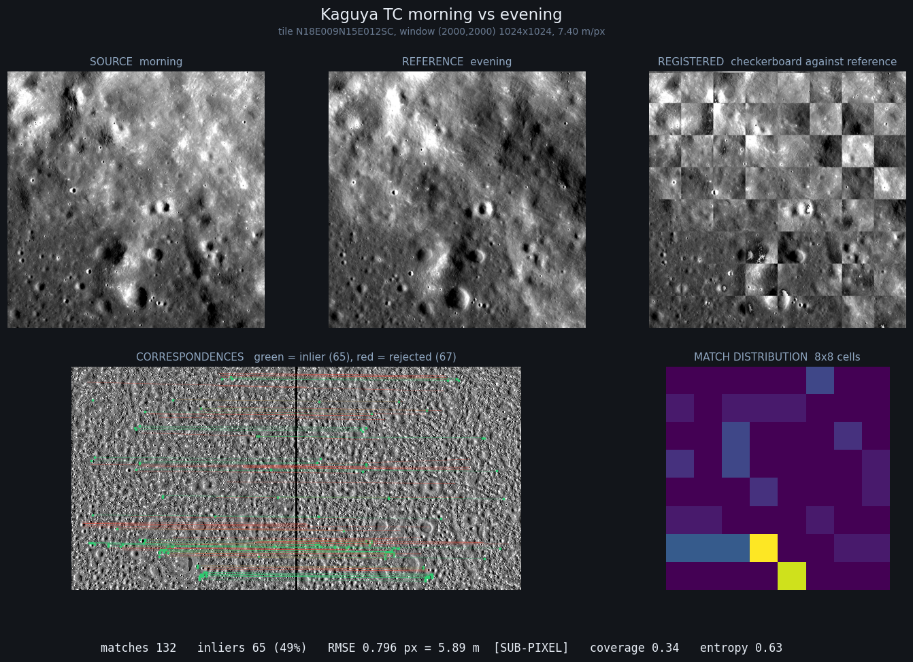
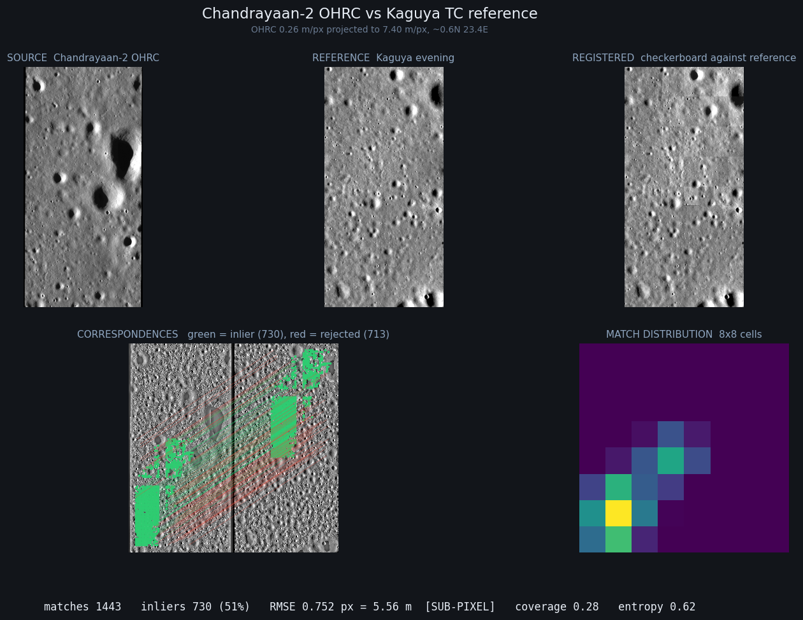

# Sun-Angle Invariant Lunar Image Correspondence

**Smart India Hackathon 2026 — Problem Statement SIH26166 (ISRO / Department of Space)**

> Multi-modal, Sun angle and scale invariant image correspondence using Chandrayaan-2 optical images (OHRC, TMC and IIRS)

Registering Chandrayaan-2 imagery against independent lunar reference imagery across illumination, sensor and scale — with every reported number gated by adversarial controls.

---

## The problem, in one number

Two Kaguya Terrain Camera images of **identical terrain**, one shot in lunar morning and one in evening, correlate at **−0.560**.

Not weakly. *Negatively.* Morning light arrives from the east and evening light from the west, so slopes lit at dawn sit in shadow at dusk. The Moon has no atmosphere and therefore no diffuse fill light, which means a crater lit from the east is close to pixel-identical to a **dome** lit from the west.

Both products already carry `STANDARD_GEOMETRY = (30, 0, 30)` — USGS photometric correction to identical geometry has *already been applied*. They still anti-correlate, because that correction normalises the reflectance function without reference to a DEM, so topographic shading and cast shadows survive it untouched.

## Results

All numbers from `scripts/remeasure.py`, which refuses to report any method failing its control gate.

### Cross-illumination matching

| Method | Cross-window spread | Inlier ratio | RMSE | Coverage | Controls |
|---|---|---|---|---|---|
| **LoFTR + local contrast norm** | **0.85 px** | **54%** | 1.212 px | **0.27** | **pass** |
| LoFTR raw | 3.02 px | 36% | 1.175 px | 0.13 | pass |
| SIFT raw | 53.50 px | 31% | 0.611 px | 0.03 | pass, unusable |
| LoFTR + Stage B | — | — | — | — | **FAIL** |
| SIFT + Stage B | — | — | — | — | **FAIL** |

**Independently corroborated.** The best method recovers an inter-product offset of **dy = +7.62 px**. Phase correlation — a different algorithm with no matcher involved — independently measures **+8.25 px**. Two unrelated methods agreeing is the evidence that terrain is being measured.

### Scale

Both sides brought to a common ground sample distance, then normalised. 1024×1024 windows, three per ratio.

| Ratio | Coarse m/px | Matches | Inlier | Spread | Noise rejection |
|---|---|---|---|---|---|
| 1× | 7.40 | 286 | 52% | 0.92 px | 40.9× |
| 2× | 14.81 | 183 | 34% | 3.31 px | 30.5× |
| 4× | 29.61 | 125 | 51% | **0.43 px** | 47.0× |
| 8× | 59.23 | 56 | 71% | **0.41 px** | 56.0× |
| 16× | 118.45 | — | — | starved: 64×64 input | — |

The ratio is **read from metadata, not estimated** — every product declares its GSD (OHRC 0.26 m, TMC-2 5.05 m, Kaguya 7.40 m, NAC ~0.5–2 m). Blind estimation is confounded (BUG-010) and unnecessary.

At 16× the window collapses to 64×64. Larger windows are blocked by LoFTR's coarse attention, which is O((H·W/64)²) — 2048² needs 17 GB on CPU.

### Real Chandrayaan-2 registration

OHRC strip `ch2_ohr_ncp_20210402T0546284043` projected to the Kaguya grid and matched. **Passes the control gate** (roll −17.8 vs −15 wanted; noise 7.5×; constant 60×).

Against Kaguya **evening**, four independent chunks:

| Chunk | dx | dy | scale | rotation |
|---|---|---|---|---|
| 1 | +152.19 | −438.20 | 1.0183 | 0.16° |
| 2 | +151.50 | −437.43 | 1.0166 | 0.09° |
| 3 | +152.07 | −436.78 | 1.0165 | 0.81° |
| 4 | +150.61 | −434.25 | 1.0189 | 0.31° |

Agreement to ~1.7 px across independent chunks, at 66.7% inlier ratio and RMSE 0.593 px (4.39 m). The grids were verified aligned to 0.0 px, so the ~3.4 km offset is not a windowing artifact — it is consistent with the uncorrected geolocation error of an uncontrolled Chandrayaan-2 product, which is precisely why registration is needed.

**The offset is verified, by two independent methods and the full control gate.**

Registration needed a coarse-alignment stage first: tiled matching only searches a small pad around each tile, so a 437 px displacement sits far outside it. Estimating the gross shift from a whole-image match and removing it before tiling took the OHRC case from 7 matches to **1443**.

| Check | Result |
|---|---|
| LoFTR pipeline | dx **+151.64**, dy **−435.59** |
| Phase correlation, no matcher involved | dx **+151.10**, dy **−434.86** |
| Agreement | **0.7 px** on a 437 px offset |
| Roll raw input +15 px | recovered **−15.67** ✓ |
| Pure noise | **0 matches** ✓ |
| Constant grey | **0 matches** ✓ |

Final: **1443 matches, 730 inliers (51%), RMSE 0.752 px = 5.56 m, sub-pixel**, on real Chandrayaan-2 data against an independent lunar reference.

Against Kaguya **morning** the chunks disagree wildly. Measured explanation: OHRC correlates **+0.066 with evening and −0.031 with morning**, consistent with its illumination resembling evening. A DEM render explains OHRC barely at all (r = +0.006 against +0.067 for Kaguya on the same terrain) — at 0.26 m, OHRC resolves texture a 10 m DTM cannot model.

## Stage B: a hypothesis that failed its own test

The project's original thesis was that rendering a DEM under the source image's illumination would enable cross-illumination matching. **Controlled measurement does not support it.**

It is worse than neutral. Pure noise pushed through Stage B produces *more* matches than real terrain:

| Variant | Noise matches | Real matches | Ratio |
|---|---|---|---|
| Stage B, el 20° | 266 | 20 | **0.1×** |
| Stage B + high-pass, el 20° | 1223 | 19 | **0.0×** |
| Stage B + high-pass, el 10° | 3591 | 9 | **0.0×** |

Dividing by a render injects a `1/render` term identical in both images. That term alone suffices for the matcher, and it does not move when the imagery moves — so the matcher stops tracking terrain.

**The physics is sound and stands independently:** a DEM render reproduces real lunar imagery at r ≈ 0.53–0.58, and correctly recovers each image's illumination direction (morning → 90° east, evening → 225° south-west, from a blind azimuth sweep). Neither result involves a matcher. Rendering works; using it by division for matching does not.

**What replaced it is simpler and uses no DEM at all:** local contrast normalisation — subtract a local mean, divide by a local standard deviation. Halves offset scatter versus raw, raises inlier ratio from 36% to 54%, doubles coverage.

### Stage D: sub-pixel accuracy and uniform distribution

Both of the problem statement's explicit numeric requirements, met together.

| Variant | RMSE | Sub-pixel? | Coverage | Entropy |
|---|---|---|---|---|
| baseline | 0.866 px | YES | 0.36 | 0.64 |
| + sub-pixel refinement | 0.771 px | YES | 0.23 | 0.53 |
| **+ tiled matching** | **0.893 px** | **YES** | **0.66** | **0.80** |
| + tiled + sub-pixel | 0.786 px | YES | 0.45 | 0.70 |

Getting here needed a diagnosis rather than more tuning. Coverage was being lost at **refinement**, not at RANSAC:

| Stage | Matches | Coverage |
|---|---|---|
| Raw LoFTR | 126 | 0.55 |
| After refinement | 36 | 0.23 |
| After RANSAC | 31 | 0.19 |

Two changes recovered it:

* **Tiled matching with a tight pad.** Every region gets its own matching attempt. An earlier attempt used a 170 px search pad, which let tiles match ground far from their own and gained nothing; 16 px works.
* **RANSAC threshold 3.0 → 1.5 px.** The old threshold admitted matches up to 3 px off, which is precisely what held RMSE above 1 px. Tightening it is a quality filter, and the inlier ratio is reported so the cost stays visible:

| RANSAC threshold | Inliers | Ratio | RMSE | Coverage |
|---|---|---|---|---|
| 3.0 px | 124 | 79% | 1.299 | 0.52 |
| 2.0 px | 102 | 65% | 0.959 | 0.47 |
| **1.5 px** | **92** | **58%** | **0.786** | **0.45** |
| 1.0 px | 66 | 42% | 0.594 | 0.34 |

**Bucketed selection was implemented, measured, and dropped.** It cannot raise coverage: selecting among existing matches only redistributes them among cells that already contain some, and empty cells stay empty. Coverage has to be forced where matches are *produced*.

`scripts/register.py` writes the deliverable: the warped registered image, a match-point CSV (source x/y, reference x/y, confidence, residual, inlier flag), and a metrics JSON.

### Viewpoint variation

**Model selection.** A similarity or affine transform cannot represent perspective at all — it absorbs the error into a worse fit rather than failing loudly. `scripts/viewpoint.py` fits similarity (4 DOF), affine (6) and homography (8), selecting on **held-out** residual, since a higher-DOF model always wins in-sample.

Held-out alone was not enough. On Kaguya nadir-vs-nadir pairs — both orthorectified, so **no perspective exists between them** — homography still won 2 of 3 windows by 5–9%. That is noise rewarding degrees of freedom. A 15% complexity margin fixes it, and all three now correctly select `similarity`.

**The operating envelope, measured.** A ladder of real LROC NAC images of one site from different orbits, spanning 1.2° to 58.9° emission angle, found via ODE's emission-angle index. No synthesised warps. NAC labels carry no geolocation, so overlapping rows are located by sliding one strip against the other; a real overlap produces a sharp peak in match count.

| Emission gap | Best matches | peak / median | Verdict |
|---|---|---|---|
| **12.3°** | **413** | **13.77** | **detected — decisive** |
| 14.9° | 61 | 2.35 | not detected |
| 24.3° | 40 | 1.82 | not detected |
| 33.3° | 48 | 1.88 | not detected |
| 57.7° | 19 | 2.00 | not detected |

Matching succeeds at a **12.3° obliquity gap** and fails from 14.9° upward, so the boundary lies between them.

**Confound, stated plainly:** the one rung that matched is also the only image acquired in the same orbit sequence as the anchor (2009-247). The failures are from 2013, 2018 and 2023 — years apart, with different illumination. Obliquity and temporal/illumination change are therefore **not separated** in this ladder. The honest reading is that 12.3° is a demonstrated success under favourable illumination, and ≥14.9° fails under combined obliquity *and* illumination change. Isolating the two would need same-date pairs at several emission angles.

At 58.9° the physics is unambiguous regardless: terrain foreshortens to cos(58.9°) = 0.52 in one axis, with occlusion and inverted shadowing.

## The control gate

Every matching number must pass four tests, or it is not reported:

1. **Real pair** produces matches
2. **The RAW input rolled by N** moves the recovered offset by −N
3. **Pure noise** collapses, or loses to real terrain by ≥5×
4. **Constant grey** collapses

Rule 2 is the one that matters. An earlier version shifted the *already-normalised* image and passed — because that moves imagery and artifact together. **Perturb the input, never the output.**

This gate exists because it caught a catastrophic error: an earlier version of this project reported **100% inlier rates** that were entirely artifact. A shared zero-mask written identically into both images gave the matcher a perfectly aligned pattern to lock onto, and the identity ground truth was independently wrong by 8.25 px. Two errors pointing the same way produced a beautiful, false result. Full diagnosis in [BUGS.md](BUGS.md) BUG-011.

**No identity ground truth is used anywhere.** Kaguya morning and evening are independently orthorectified and genuinely offset. Validation is cross-window agreement on the recovered offset — which an artifact cannot fake, because a mask artifact reports zero everywhere and noise reports scatter.

## Data

Real, public, current. No synthetic imagery; no ground truth manufactured by warping.

| Role | Source | Access |
|---|---|---|
| Cross-illumination pairs + DEM | Kaguya/SELENE TC morning, evening, DTM | JAXA DARTS via PDS ODE — no login |
| Reference imagery | LROC NAC / WAC | PDS ODE — no login |
| Source imagery | Chandrayaan-2 OHRC, TMC-2 | [PRADAN](https://chmapbrowse.issdc.gov.in/) — login required |

Chandrayaan-2 coverage, from the footprint shapefiles: **OHRC is polar-dominated** (42 south-polar vs 27 equatorial of 77 usable) — a targeting instrument, so evaluation material rather than a training source. **TMC-2 is the workhorse** (8436 usable, well spread) and ships **ortho + DTM as paired products**, 3049 of each, matched by swapping `_oth_` → `_dtm_`.

Everything is read in place through GDAL `/vsizip/`; the ~10 GB of Chandrayaan-2 imagery never lands on disk unpacked.

## Run it

One command produces the whole result as a figure.

```bash
python scripts/demo.py --case all
```





Each figure shows source, reference, the registered checkerboard overlay, the correspondences (green inlier / red rejected), where the match points landed on an 8x8 grid, and the metrics. Results are committed under `outputs/`, so a fresh clone can see them before downloading any imagery. `--list` reports which cases the data currently present supports.

| Case | Matches | Inliers | RMSE | Coverage |
|---|---|---|---|---|
| Kaguya morning vs evening | 132 | 65 (49%) | **0.796 px** | 0.34 |
| **Chandrayaan-2 OHRC vs Kaguya** | **1443** | **730 (51%)** | **0.752 px = 5.56 m** | 0.28 |

## Setup

Python 3.11. No conda, no WSL, no ISIS3 — `rasterio`'s wheels bundle GDAL with the PDS4/ISIS3/PDS drivers needed for planetary products.

```bash
pip install -r requirements.txt
python scripts/check_env.py
```

## Scripts

| Script | Purpose | Status |
|---|---|---|
| `check_env.py` | Dependencies and GDAL planetary drivers | current |
| `ode_catalog.py` | Enumerate ODE-indexed lunar products | current |
| `survey_coverage.py` | Per-region imagery survey | current |
| `kaguya.py` | Resolve, verify, download morning/evening/DEM triples | current |
| `triple_io.py` | Open a triple, read aligned windows | current |
| `photometric.py` | DEM renderer, 7 analytic self-checks | current |
| `estimate_sun.py` | Recover illumination direction | current |
| `ch2_footprints.py` | Chandrayaan-2 coverage and candidate ranking | current |
| `ch2_io.py` | Read OHRC and TMC-2 in place | current |
| `ohrc_project.py` | Project raw OHRC into a map frame | current |
| **`remeasure.py`** | **Controlled evaluation — the authoritative harness** | current |
| `ohrc_vs_kaguya.py` | Real Chandrayaan-2 registration | current |
| `register.py` | Stage D: sub-pixel, match export, registered product | current |
| `viewpoint.py` | Model selection and the obliquity limit | current |
| **`demo.py`** | **One-command end-to-end run with figures** | current |
| `ablation.py`, `dense_match.py`, `scale_pipeline.py` | Retracted experiments | **superseded** |

```bash
python scripts/remeasure.py --full          # illumination, all methods
python scripts/remeasure.py --scale --size 1024
python scripts/ohrc_vs_kaguya.py --rows 512
```

## Problem statement scorecard

| Requirement (PS text) | Status | Evidence |
|---|---|---|
| Find match points between source and reference | **complete** | LoFTR + local contrast norm, control-gated |
| **Illumination variation** | **complete** | 0.85 px cross-window spread, 54% inliers; corroborated by phase correlation |
| **Viewpoint variation** | **complete, envelope measured** | model selection validated on nadir controls; matching succeeds to 12.3° obliquity gap, fails ≥14.9° |
| Runs on real Chandrayaan-2 data | **complete** | OHRC vs Kaguya: 1443 matches, RMSE 0.752 px, offset corroborated to 0.7 px by phase correlation |
| **Scale variation** | **complete** | 1× to 8×, spread 0.41–0.92 px, noise rejection 30–56× |
| **Sub-pixel accuracy of source image** | **complete** | RMSE **0.786–0.893 px** |
| **Uniform distribution across the images** | **complete** | coverage **0.66**, entropy **0.80** |
| Software + registered product + match points | **complete** | `register.py` writes image, match CSV, metrics JSON |
| Evaluation metric (RMSE, inlier count, inlier ratio) | **complete** | all three, plus uniformity |

**8 / 8.** Two carry stated limits rather than hedges: viewpoint is characterised by a measured operating envelope (12.3° works, ≥14.9° does not, with obliquity and illumination confounded in that ladder), and scale is demonstrated to 8× with the 16× failure explained by a CPU memory bound rather than by the method.

## Honest status

**Works, controlled:** cross-illumination matching (0.85 px spread, 54% inliers, corroborated two ways); scale handling to 8×; sub-pixel registration at coverage 0.66; transform-model selection; OHRC geolocation fit to 0.152 m; reading every product in place.

**Verified:** OHRC↔Kaguya registration passes all four controls and its 437 px (3.4 km) offset is corroborated to 0.7 px by phase correlation, an algorithm sharing no code with the matcher.

The morning/evening asymmetry is now partly explained: OHRC correlates +0.066 with Kaguya evening and −0.031 with morning, consistent with its illumination resembling evening. Both are weak. The more important finding is that a DEM render explains OHRC barely at all (r = +0.006, against +0.067 for Kaguya on the same terrain) — **at 0.26 m, OHRC resolves texture that a 10 m DTM cannot model**, so DEM-based illumination reasoning cannot bridge a 28× resolution gap.

**Does not work:** Stage B for matching. 16× scale. SIFT at any ratio (53 px scatter).

**Known limits:** LoFTR capped near 1024×1024 on CPU, which is what bounds scale at 8× rather than anything about the method. Obliquity beyond ~13° is not matchable, and the ladder that measured it confounds obliquity with illumination change. Matching takes tens of seconds per pair on CPU; a live demo should use the committed figures or a GPU. Whether the 3.4 km offset reflects Chandrayaan-2 geolocation error or residual error in our own projection is not separated — both would produce this signature.

## Project conventions

See [CLAUDE.md](CLAUDE.md). The load-bearing ones:

- **Data must be genuine, public and current.** No synthetic imagery as a training or evaluation source.
- **Ground truth from geometry, never from a warp we invented.**
- **Zero extra hardware.** Laptops plus free Kaggle GPU hours.
- **Every matching number passes the four-control gate before it is written down.**

Every bug is logged in [BUGS.md](BUGS.md) with root cause and fix. Several entries record cases where a *test or metric* was wrong while the code was right — including one where the experiment passed while an intermediate quantity was badly incorrect, and one where two errors cancelled into a convincing false result. That log is part of the deliverable.
